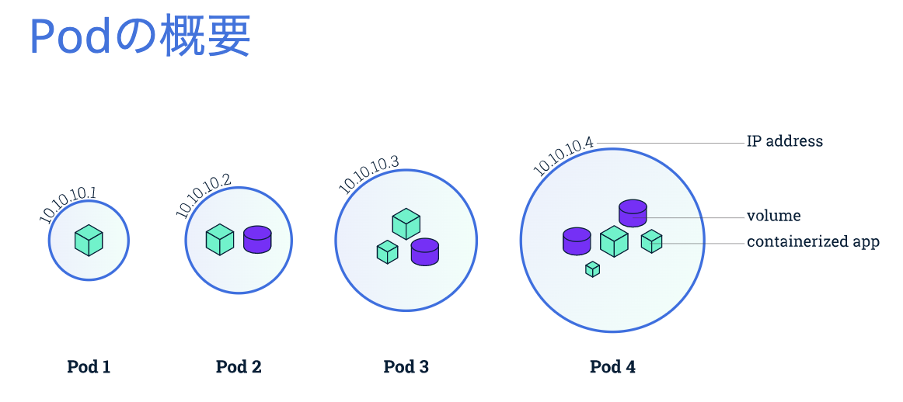
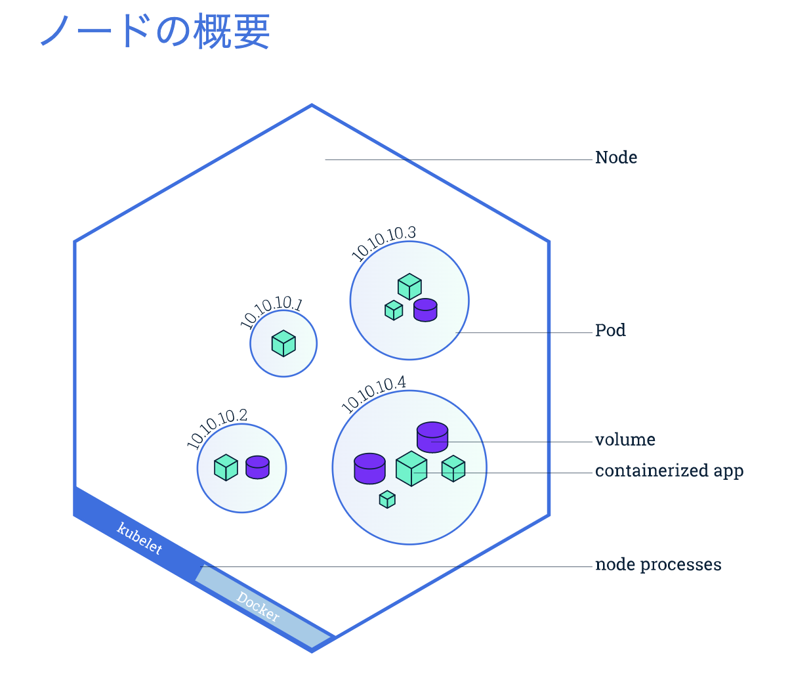
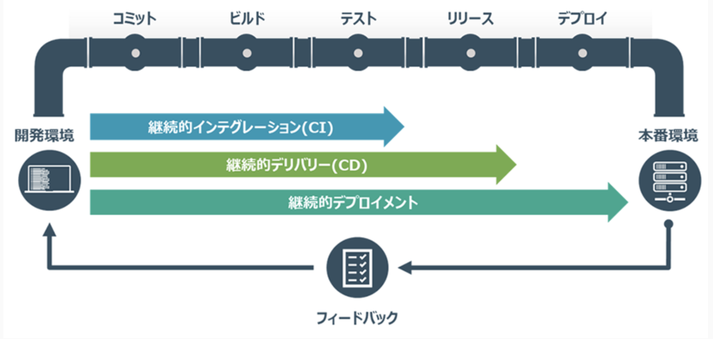

## kubernetes engine

#### 用語

- pod：VM のようなもので   ネットワークとストレージを共有する コンテナグループ内で   ノード自体から分離されている

- node（kubelets）：Kubenetes の エージェント兼ノード

- cluster：node の集合
- service：ポッドに固定 IP を割り当て   それを複製して他のポッドや サービスとの通信を可能にしたもの。ポッド間の 通信手段として機能
- label
- selector：API オブジェクトの ID を表すメタデータ。  グループ化、メカニズム、検索に使われる。Pod などのオブジェクトに割り当てられたキーとバリューのペア

#### Jenkins と Spinnaker

**Jenkins**：CI(継続的インテグレーション)や CD(継続的デリバリー)を実現するプロダクトとして人気

**Spinnaker**：マルチクラウドに対応した CD(継続デリバリのプラットフォーム)

&rarr;CD は継続的インテグレーション(CI)を延長して、より高レベルの結合とテストなどを自動的に行い、新しい変更がリリース（本番環境へデプロイ）可能であることを保証するプロセス

&rarr; 継続的デリバリーでは、コンテナをプログラムによって起動、停止できるため、コンテナを構成する時間が節約できる

開発者が書いた新しいコードとマスターブランチを頻繁に統合するプロセス。新しい機能開発のためにブランチを作成する場合、つぎにマージするまでの期間が長くなるにしたがって変更量が多くなり、マージ作業が大変になるだけでなく、問題が含まれるコードの特定と分離が難しくなる。一回のコミットでの変更量を小さくして頻繁にマージすれば、問題の発見が早くなり対処が楽になる。問題発見のオーバーヘッドを小さくするために自動化されたテストを行う。

